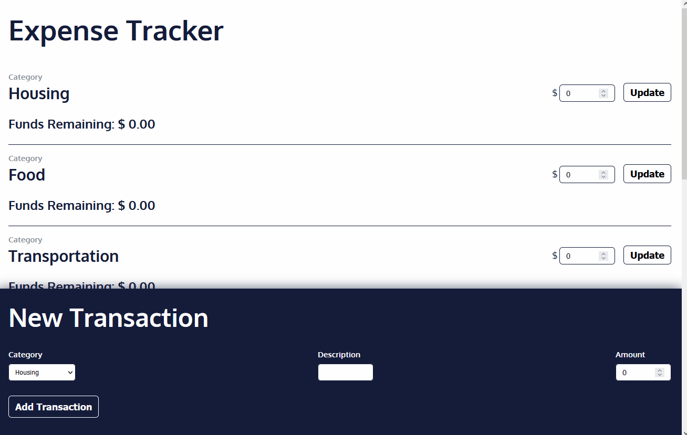

# Finance-Tracker

This is a React.js application where you can set your budget for especific items and add transactions you made.

## Demo

To see the demo in higher quality click on the gif below.

## Run

Run 'npm start' to run the app.

Open [http://localhost:3000](http://localhost:3000) to view it in the browser.